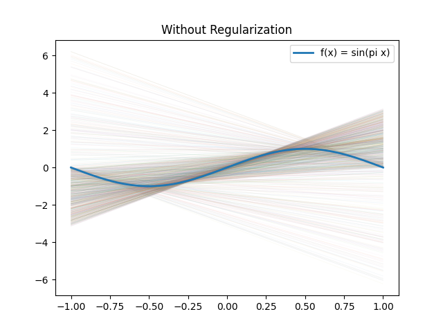
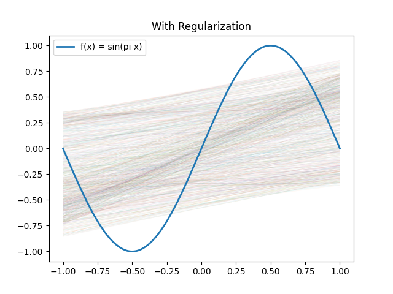

# Problem I

## Margin-Based Linear Classification (Hinge Loss)

### 1. Hinge Loss and Large-Margin Classification

Write answer here.

$$
c(\hat{y}, y) = \max(0, 1 - y\hat{y})
$$

where $\hat{y} = h(x_1,x_2)$.

### 2. Subgradients of the Hinge Loss

The hypothesis is:

$$
h(x_1,x_2)=w_0+w_1x_1+w_2x_2
$$

Define the margin:

$$
m = yh(x_1,x_2)
$$

The hinge loss can be written as:

$$
c(h(x_1,x_2),y)=
\begin{cases}
0, & \text{if } m \ge 1 \\
1-yh(x_1,x_2), & \text{if } m < 1
\end{cases}
$$

### 3. Stochastic Gradient Descent

Initial weights:

$$
(w_0,w_1,w_2)=(0,0,0)
$$

Learning rate:

$$
\eta = 0.1
$$

| Iteration | $(x_1,x_2,y)$ | Margin $m$ | Updated $(w_0,w_1,w_2)$ |
|---:|---:|---:|---:|
| 1 | $(-4,0,-1)$ |  |  |
| 2 | $(-1,1,+1)$ |  |  |
| 3 | $(0,-1,-1)$ |  |  |
| 4 | $(2,1,+1)$ |  |  |
| 5 | $(3,0,+1)$ |  |  |
| 6 | $(6,-1,-1)$ |  |  |

### 4. Misclassification Rate

Final hypothesis:

$$
h(x_1,x_2)=
$$

| Point | True $y$ | $h(x_1,x_2)$ | Prediction | Correct? |
|---:|---:|---:|---:|---:|
| $(-4,0)$ | $-1$ |  |  |  |
| $(-1,1)$ | $+1$ |  |  |  |
| $(0,-1)$ | $-1$ |  |  |  |
| $(2,1)$ | $+1$ |  |  |  |
| $(3,0)$ | $+1$ |  |  |  |
| $(6,-1)$ | $-1$ |  |  |  |

Misclassification rate:

$$
\frac{\text{number of mistakes}}{\text{total examples}} =
$$

# Problem II

## Regularization

### 1. Gradients of the Sum-of-Squared-Errors Cost

The cost function is:

$$
C(w) = (y_1 - (w_0 + w_1 x_1))^2 + (y_2 - (w_0 + w_1 x_2))^2
$$

Define error terms:

$$
e_1 = y_1 - (w_0 + w_1 x_1)
$$

$$
e_2 = y_2 - (w_0 + w_1 x_2)
$$

So:

$$
C(w) = e_1^2 + e_2^2
$$

Derivative with respect to $w_0$

$$
\frac{\partial C}{\partial w_0}
= \frac{\partial}{\partial w_0}(e_1^2 + e_2^2)
$$

Apply chain rule:

$$
= 2e_1 \frac{\partial e_1}{\partial w_0} + 2e_2 \frac{\partial e_2}{\partial w_0}
$$

$$
\frac{\partial e_1}{\partial w_0} = -1, \quad
\frac{\partial e_2}{\partial w_0} = -1
$$

$$
\frac{\partial C}{\partial w_0}
= 2e_1(-1) + 2e_2(-1)
= -2e_1 - 2e_2
$$

Final:

$$
\frac{\partial C}{\partial w_0}
= -2(y_1 - (w_0 + w_1 x_1)) - 2(y_2 - (w_0 + w_1 x_2))
$$

Equivalent:

$$
\frac{\partial C}{\partial w_0}
= 2(w_0 + w_1 x_1 - y_1) + 2(w_0 + w_1 x_2 - y_2)
$$

Derivative with respect to $w_1$

$$
\frac{\partial C}{\partial w_1}
= \frac{\partial}{\partial w_1}(e_1^2 + e_2^2)
$$

$$
= 2e_1 \frac{\partial e_1}{\partial w_1} + 2e_2 \frac{\partial e_2}{\partial w_1}
$$

$$
\frac{\partial e_1}{\partial w_1} = -x_1, \quad
\frac{\partial e_2}{\partial w_1} = -x_2
$$

$$
\frac{\partial C}{\partial w_1}
= 2e_1(-x_1) + 2e_2(-x_2)
= -2x_1 e_1 - 2x_2 e_2
$$

Final:

$$
\frac{\partial C}{\partial w_1}
= -2x_1(y_1 - (w_0 + w_1 x_1)) - 2x_2(y_2 - (w_0 + w_1 x_2))
$$

Equivalent:

$$
\frac{\partial C}{\partial w_1}
= 2x_1(w_0 + w_1 x_1 - y_1) + 2x_2(w_0 + w_1 x_2 - y_2)
$$

### 2. Gradients with $\ell_2$ Regularization

The regularized cost function is:

$$
\tilde{C}(w)
= (y_1 - (w_0 + w_1 x_1))^2
+ (y_2 - (w_0 + w_1 x_2))^2
+ \lambda (w_0^2 + w_1^2)
$$

Derivative with respect to $w_0$

$$
\frac{\partial \tilde{C}}{\partial w_0}
= \frac{\partial C}{\partial w_0} + \frac{\partial}{\partial w_0} \lambda (w_0^2 + w_1^2)
$$

$$
= -2(y_1 - (w_0 + w_1 x_1)) - 2(y_2 - (w_0 + w_1 x_2)) + 2\lambda w_0
$$

Equivalent:

$$
\frac{\partial \tilde{C}}{\partial w_0}
= 2(w_0 + w_1 x_1 - y_1) + 2(w_0 + w_1 x_2 - y_2) + 2\lambda w_0
$$

Derivative with respect to $w_1$

$$
\frac{\partial \tilde{C}}{\partial w_1}
= \frac{\partial C}{\partial w_1} + \frac{\partial}{\partial w_1} \lambda (w_0^2 + w_1^2)
$$

$$
= -2x_1(y_1 - (w_0 + w_1 x_1)) - 2x_2(y_2 - (w_0 + w_1 x_2)) + 2\lambda w_1
$$

Equivalent:

$$
\frac{\partial \tilde{C}}{\partial w_1}
= 2x_1(w_0 + w_1 x_1 - y_1) + 2x_2(w_0 + w_1 x_2 - y_2) + 2\lambda w_1
$$

### 5. Experiment Results

We conducted an experiment over 1000 trials. In each trial, two training examples were sampled uniformly at random from the interval [-1, 1] using the target function $f(x) = \sin(\pi x)$. For each sample, we computed a linear model both without regularization and with regularization ($\lambda = 1$), and evaluated their out-of-sample performance using the provided test set.

The average test error without regularization was:

**1.80348**

The average test error with regularization was:

**0.44387**

These results show that the model with regularization achieves significantly lower test error. Without regularization, the model fits the two training points exactly, which leads to large variability in the learned parameters and poor generalization. In contrast, regularization penalizes large parameter values, producing more stable models that generalize better to unseen data.

### 6. Extra Credit: Visualization

Without Regularization

With Regularization

The plots illustrate the effect of regularization on model variability by showing the fitted lines from 1000 trials.

In the **unregularized case**, the fitted lines vary widely and often exhibit very steep slopes. This occurs because each model is trained on only two data points, causing the learned hypothesis to depend heavily on the specific sample. As a result, the models have high variance and fluctuate significantly across trials.

In the **regularized case**, the fitted lines are much more tightly clustered and have less extreme slopes. Regularization discourages large parameter values, which reduces the variability of the learned models. Although the hypotheses are still linear and cannot perfectly match the nonlinear sine function, they are more stable and better aligned with the overall trend of the target function.

Overall, the plots demonstrate that regularization reduces overfitting by limiting model complexity, resulting in improved generalization and lower test error.

# GenAI Usage

GenAI was used to help check derivations, verify calculations, and format the final solution. The output was reviewed and edited before submission.

Emily: ChatGPT was used to help check formulasand format the final solution. I also used ChatGPT to help with the code for the graphs. The output was reviewed and edited before submission.